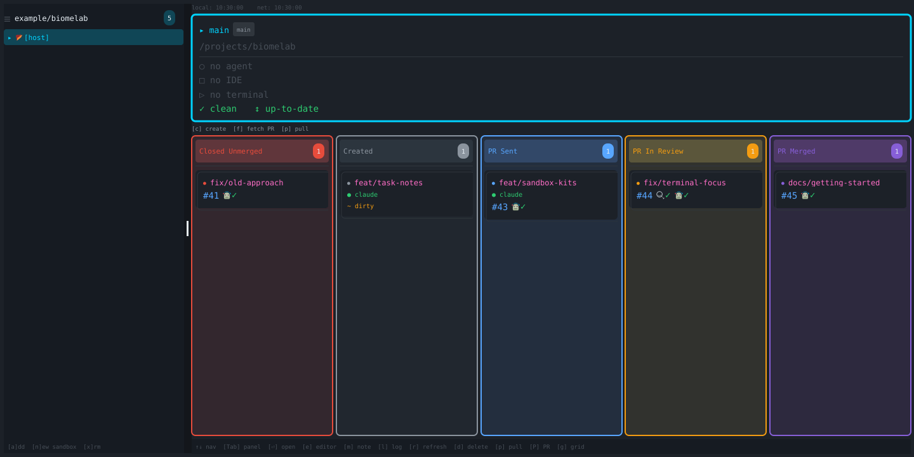

# BiomeLab

A desktop GUI for managing Git worktrees and the coding agents running inside them. Built with Go and Fyne for macOS, Linux, and Windows.

## Get started

On macOS:

```bash
brew install --cask mdelapenya/tap/biomelab
```

Open `Biomelab.app`, focus the projects panel, and press `a` to add a repository. Or launch `biomelab` from inside a repository to register it in host mode. Select the main card and press `c` to create a worktree, then select its card and press `Enter` to open a terminal.

See [installation](docs/installation.md) for packaged downloads, nightly builds, source builds, and optional CLI integrations.

## Features

- **Multiple repositories:** switch between host and per-agent sandbox modes; drag repository handles to save your preferred order.
- **Kanban and grid:** follow five PR/MR lifecycle stages, or press `g` for detailed worktree cards. See dirty state, sync status, reviews, and CI results.
- **Activity detection:** find Claude, Kiro, Copilot, Codex, OpenCode, and Gemini processes, plus supported IDEs and host terminals.
- **Worktree operations:** create/delete worktrees, fetch GitHub PRs, pull changes, and push/create GitHub PRs or GitLab MRs.
- **Docker Sandboxes:** create, register, start, stop, and remove a sandbox per agent per repository; optionally select compatible kits during creation.
- **Task notes:** edit Markdown and a PR title beside the code, then choose to use them when creating a PR/MR.
- **Agent activity:** view recorded re_gent sessions and export JSON when the optional `rgt` integration is available.
- **Desktop controls:** mouse and keyboard navigation, dark/light themes, zoom, terminal activation, editor launch, and a tray with dependency diagnostics.
- **Automatic refresh:** local state every five seconds; network state every 30 seconds by default, configurable by flag or environment.

Docker Sandboxes are recommended for agent execution. Host mode is also available. Sandboxes isolate toolchains and execution; worktrees and notes are shared with the host, so agent edits remain visible in your workspace.



*Rendered from the application’s Fyne widgets with sample data.*

## User guides

| Guide | Covers |
|---|---|
| [Installation](docs/installation.md) | Releases, prerequisites, source builds, nightlies |
| [Dashboard and worktrees](docs/dashboard.md) | Views, shortcuts, navigation, PR/MR workflow, tray |
| [Sandbox workflows](docs/sandboxes.md) | Setup, kits, shared files, lifecycle |
| [Notes and agent activity](docs/notes-and-activity.md) | PR drafts, re_gent setup, logs and export |
| [Configuration and troubleshooting](docs/configuration.md) | OS-specific settings, CLI flags, environment, diagnostics |
| [Known limitations](docs/known-limitations.md) | Current implementation gaps and workarounds |

The [website](https://biomelab.dev/) includes an interactive browser demonstration with sample data.

## Contributing and releases

See [ARCHITECTURE.md](ARCHITECTURE.md) for package layout and design, and [RELEASING.md](RELEASING.md) for build pipelines and release checks. `task build`, `task test-race`, and `task lint` use the source build prerequisites in the installation guide.

## License

[MIT](LICENSE).
